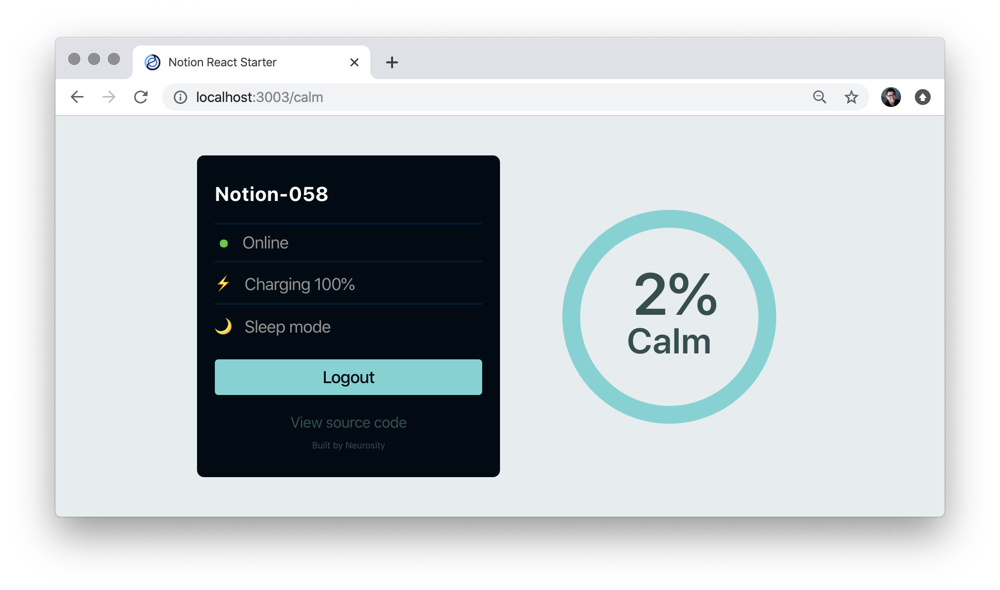

# 🚀 TFG - Daniel Oriol Niso Galán

Desarrollo e implementación de un sistema de neurofeedback para EEG inalámbrico

2023

GRADO EN INGENIERÍA DE TECNOLOGÍAS Y SERVICIOS DE TELECOMUNICACIÓN
Universidad Autónoma de Madrid

### Getting Started

- 1️⃣ `git clone https://github.com/xxxx.git`
- 2️⃣ `cd app-nfb`
- 3️⃣ `npm install`
- 4️⃣ `npm start`

MIT License
